# 🛍️ PopFitUp
네이버 지도 기반 팝업스토어 탐색 서비스 (Frontend & Backend)

> 네이버 지도/로컬 검색 결과를 기반으로 수집된 팝업스토어 데이터를 활용하여  
> **검색 · 탐색 · 즐겨찾기 · 제보** 기능을 제공하는 웹 서비스입니다.

---

## 📌 Table of Contents
- 프로젝트 개요
- 서비스 주요 화면
- 전체 아키텍처
- Backend 주요 기능
- Frontend 주요 기능
- 인증 및 보안
- 관리자 기능
- API 요약
- 환경변수 설정
- 기타 구현 포인트

---

## 1️⃣ 프로젝트 개요
**PopFitUp**은 지역·날짜·카테고리 기준으로  
현재 운영 중이거나 예정된 팝업스토어를 한눈에 탐색할 수 있는 서비스입니다.

백엔드에서 수집·정제된 팝업 데이터를 기반으로,  
프론트엔드는 사용자가 직관적으로 탐색할 수 있는 UI/UX에 집중하여 구현되었습니다.

---

## 🖼️ 서비스 주요 화면

### 🏠 홈 / 검색
- 지역 · 날짜 · 카테고리 기반 검색
- 최신 / 인기 / 월별 팝업 탐색

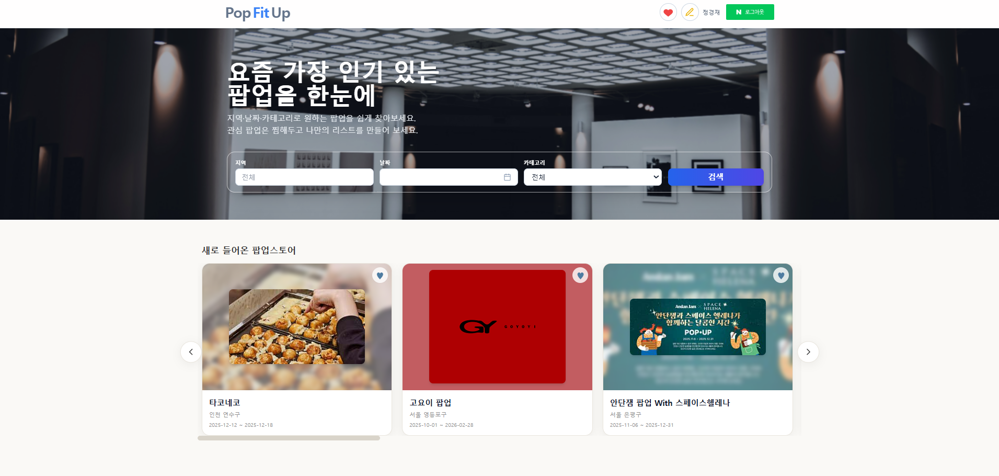
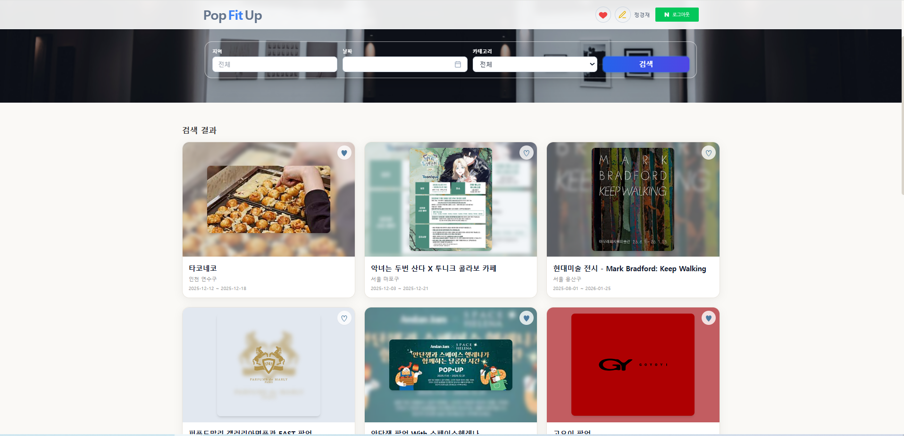

---

### 📍 팝업 상세 페이지
- 대표 이미지 기반 상세 정보
- 카테고리 / 지역 태그 시각화
- 네이버 지도 기반 위치 표시
- 비슷한 카테고리 / 주변 지역 팝업 추천

**① 기본 정보 & 대표 이미지**
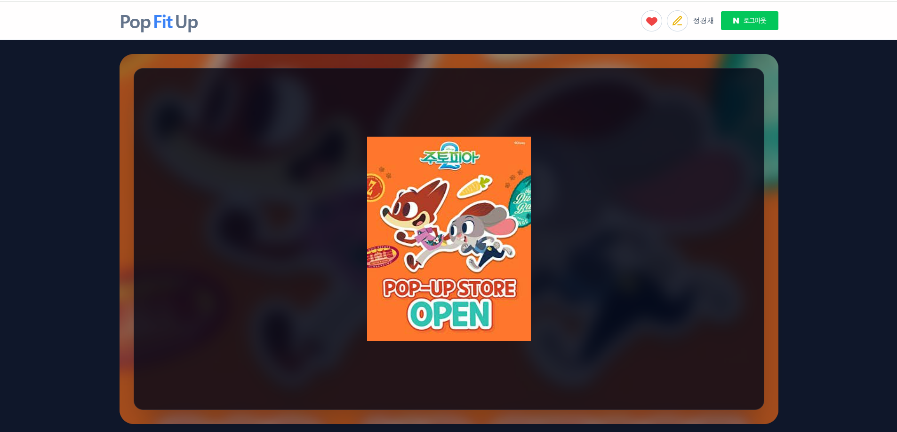

**② 지도 기반 위치 정보**
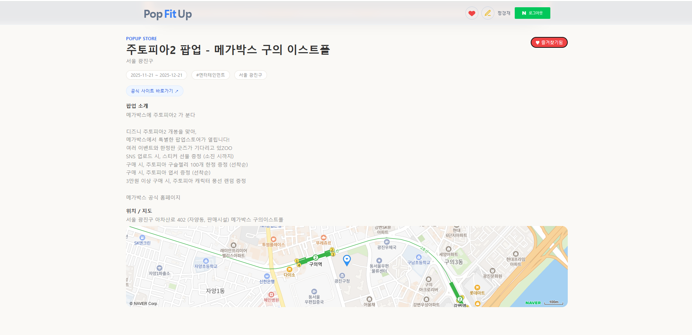

**③ 카테고리 / 지역 맞춤 추천**
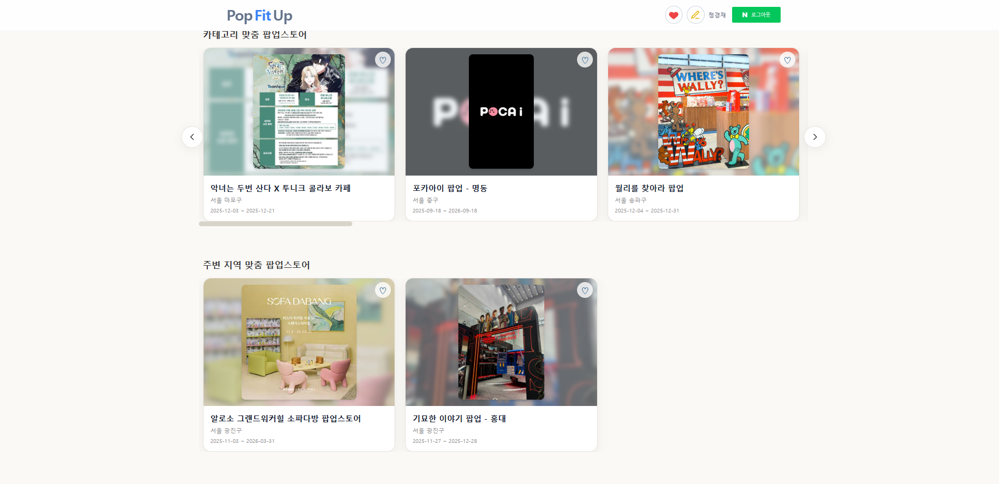

---

### ❤️ 즐겨찾기
- 로그인 사용자 전용
- 지도 마커 + 리스트 동기화
- 마커 클릭 → 카드 자동 스크롤

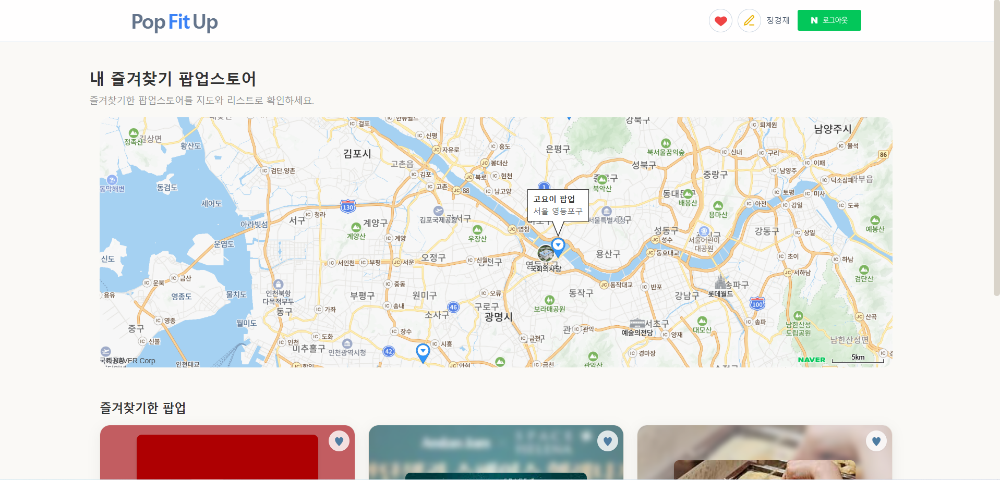

---

### 📝 팝업 제보
- 로그인 사용자만 제보 가능
- 내 제보 목록 / 삭제 지원

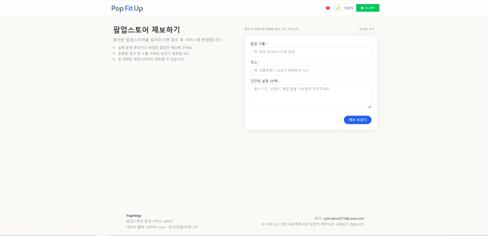

---

### 🛠️ 관리자 페이지
- 관리자 키 기반 접근 제어
- 제보 목록 조회 / 답변 등록 / 삭제

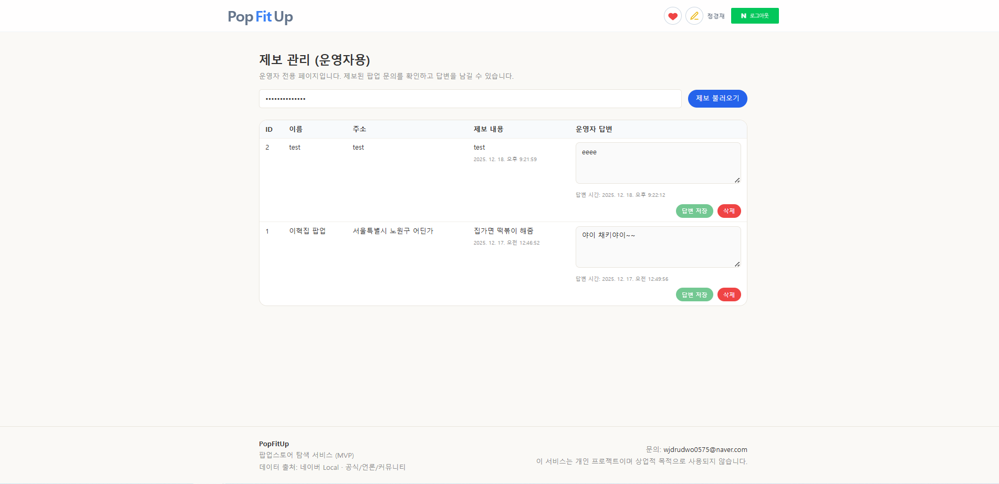

---

## 2️⃣ 전체 아키텍처 (Architecture Overview)

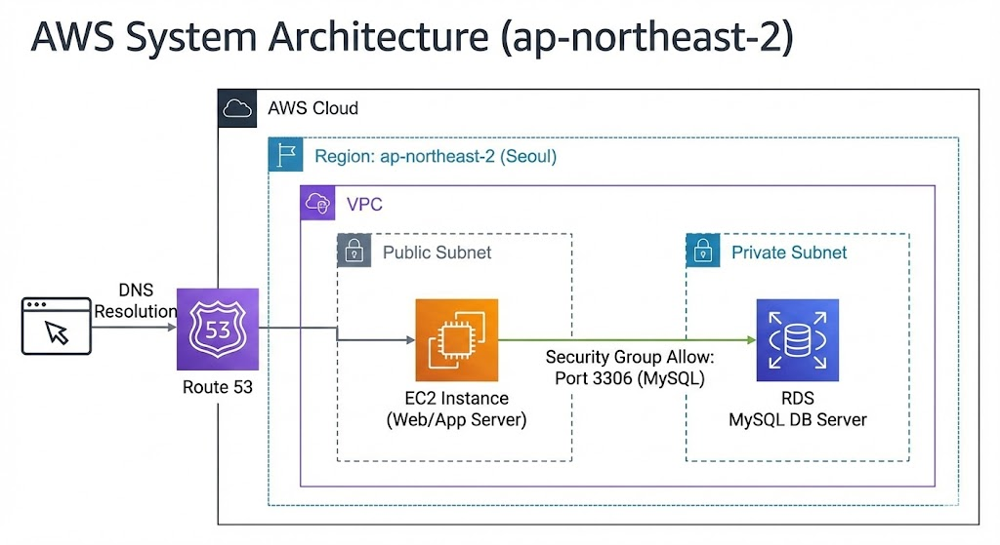

[ Client (Browser) ]
↓ HTTPS
[ Nginx (EC2 :443) ]
↓ HTTP
[ Node.js Backend (EC2 :3000) ]
↓
[ MySQL (RDS) ]

---

## 3️⃣ Backend 주요 기능

### 🌐 (1) 팝업스토어 데이터 제공 API
- 네이버 지도 기반으로 수집된 팝업스토어 데이터 제공
- 지역 / 날짜 / 카테고리 기반 필터링
- 페이지네이션 기반 검색 결과 반환

### 🗂️ (2) 카테고리 자동 분류
- OpenAI API를 활용한 자동 카테고리 분류
- 하나의 팝업에 복수 카테고리 허용
- 프론트에서는 해시태그 형태로 표현

### ⭐ (3) 인기 / 최신 팝업 기준
- **인기 팝업**
  - 즐겨찾기(찜) 수 기준
  - 주간 조회수(weekly_view_count) 함께 활용
- **새로 들어온 팝업**
  - `updated_at` 기준 최신 순 정렬

### ❤️ (4) 즐겨찾기(찜) 기능
- 로그인 사용자 기준 즐겨찾기 등록 / 해제
- 사용자별 즐겨찾기 목록 조회
- 즐겨찾기 수는 DB 트리거를 통해 자동 관리

**ERD**
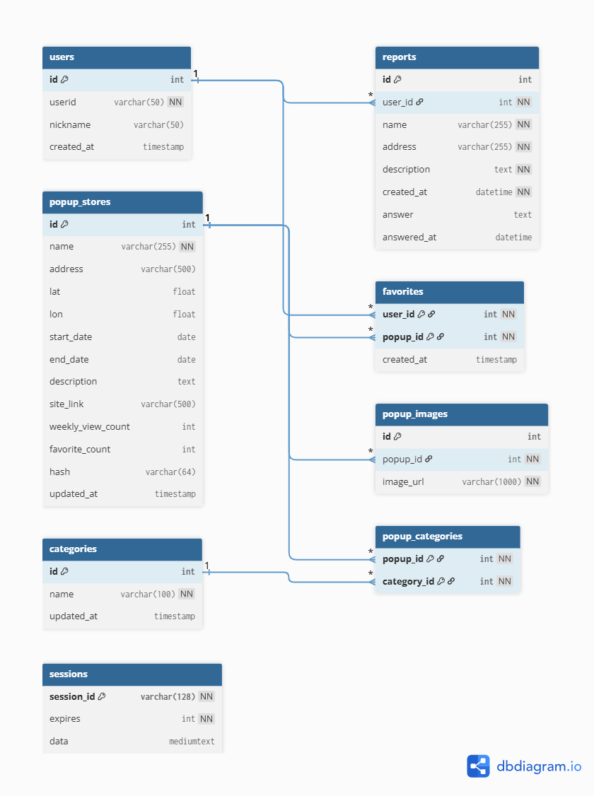

---

## 4️⃣ Frontend 주요 기능

### 🏠 (1) 메인 화면(UI & 검색)
- 지역 / 날짜 / 카테고리 입력 UI
- URL 기반 검색 상태 유지
- 검색 결과 페이지네이션 지원

### 🧭 (2) 홈 화면 탐색 섹션
- 새로 들어온 팝업
- 인기 있는 팝업
- 월별 팝업 (월 선택 UI)
- 캐러셀 / 그리드 레이아웃 지원

### 📍 (3) 상세 페이지
- 팝업 상세 정보 제공
- 카테고리 / 지역 태그 시각화
- 네이버 지도 기반 위치 표시
- 비슷한 팝업 추천

### 📝 (4) 제보 / 운영자 UI
- 팝업 제보 등록
- 내 제보 목록 확인
- 운영자 답변 확인

### 📱 (5) 반응형(Responsive) UI 고려
- 메인 Hero 필터바를 모바일/태블릿/데스크탑에 맞게 그리드 레이아웃으로 구성  
  (`grid-cols-1` → `sm:grid-cols-[...]`)
- 카드 리스트/검색 결과/즐겨찾기 목록을 반응형 Grid로 구성  
  (`grid-cols-2` → `sm:grid-cols-3` 등)
- 홈 섹션 캐러셀은 화면 너비에 따라 카드 폭 및 화살표 노출을 조절  
  (overflow-x + ResizeObserver로 scrollWidth 기준)
- 지도 영역은 모바일/데스크탑에서 높이를 다르게 적용하여 가독성 확보  
  (`h-72 sm:h-80 md:h-96` 등)
- 헤더 네비게이션은 데스크탑/모바일 UI를 분리해 사용성 최적화  
  (데스크탑 아이콘/버튼 + 모바일 햄버거 메뉴)

---

## 5️⃣ 인증 및 보안
- 네이버 OAuth 기반 소셜 로그인
- 세션/쿠키 기반 인증
- HTTPS 환경에서만 쿠키 동작
- Nginx SSL Termination 적용

### 🔐 인증 플로우 (Naver OAuth + Session Cookie)

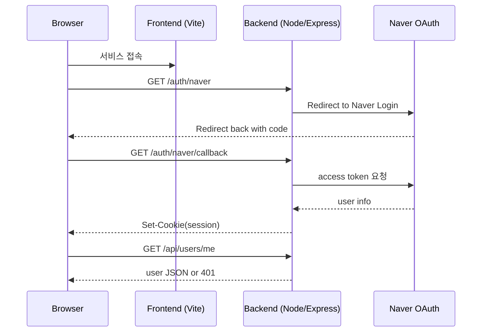

## 6️⃣ 관리자 기능 (Admin)
- 관리자 키 기반 접근 제어
- 제보 목록 조회
- 답변 등록 (1회 제한)
- 제보 삭제

## 7️⃣ API 요약

| Method | Endpoint | Description |
| --- | --- | --- |
| GET | `/api/popups/home` | 홈 데이터 (latest, popular, monthly) |
| GET | `/api/popups` | 팝업 검색 |
| GET | `/api/popups/:id` | 팝업 상세 |
| POST | `/api/favorites` | 즐겨찾기 추가 |
| DELETE | `/api/favorites/:id` | 즐겨찾기 삭제 |
| POST | `/api/reports` | 팝업 제보 |
| GET | `/api/reports/mine` | 내 제보 목록 |

## 8️⃣ 환경변수 설정
```
Frontend (.env)
VITE_API_URL=https://api.popfitup.com

Backend (.env)
DB_HOST=localhost
DB_USER=root
DB_PASSWORD=****
DB_NAME=popup_db
NAVER_CLIENT_ID=****
NAVER_REDIRECT_URI=****
NAVER CLIENT_SECRET=****
NAVER_STATE=****
NODE_ENV=development
SESSION_SECRET=****
REPORT_ADMIN_KEY=****
PORT=5173
```

## 9️⃣ 기타 구현 포인트
- 지도 SDK 비동기 로딩 안정성 처리
- 로그인 필요 기능 공통 컴포넌트 처리
- 즐겨찾기 / 검색 상태 URL 동기화
- 에러 / 로딩 상태 UX 분기 처리
