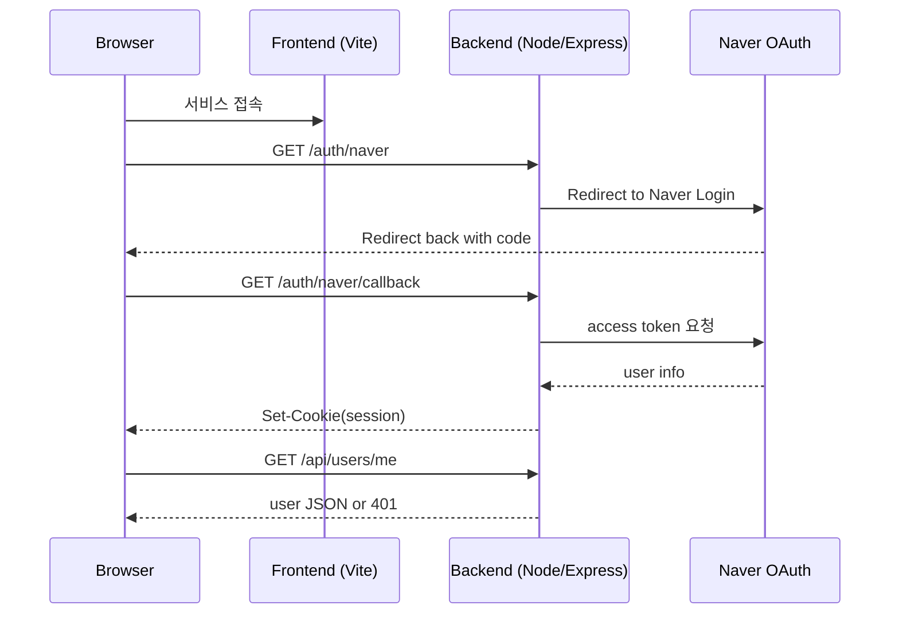

# 🛍️ PopFitUp
네이버 지도 기반 팝업스토어 탐색 서비스 (Frontend & Backend)

> 네이버 지도/로컬 검색 결과를 기반으로 수집된 팝업스토어 데이터를 활용하여  
> **검색 · 탐색 · 즐겨찾기 · 제보** 기능을 제공하는 웹 서비스입니다.

#### 🚀 서비스 배포 현황 (Deployment Status)

| 서비스명 | URL | 상태 |
| :--- | :--- | :--- |
| **PopFitUp Web** | **[https://popfitup.store](https://popfitup.store)** |  |---

---

## 📌 Table of Contents
- 프로젝트 개요
- 서비스 주요 화면
- 전체 아키텍처
- Backend 주요 기능
- Frontend 주요 기능
- 인증 및 보안
- 관리자 기능
- API 요약
- 환경변수 설정
- 기타 구현 포인트

---

## 1️⃣ 프로젝트 개요
**PopFitUp**은 지역·날짜·카테고리 기준으로  
현재 운영 중이거나 예정된 팝업스토어를 한눈에 탐색할 수 있는 서비스입니다.

백엔드에서 수집·정제된 팝업 데이터를 기반으로,  
프론트엔드는 사용자가 직관적으로 탐색할 수 있는 UI/UX에 집중하여 구현되었습니다.

---

## 🖼️ 서비스 주요 화면

### 🏠 홈 / 검색
- 지역 · 날짜 · 카테고리 기반 검색
- 최신 / 인기 / 월별 팝업 탐색


---

### 📍 팝업 상세 페이지
- 대표 이미지 기반 상세 정보
- 카테고리 / 지역 태그 시각화
- 네이버 지도 기반 위치 표시
- 비슷한 카테고리 / 주변 지역 팝업 추천

**① 기본 정보 & 대표 이미지**


**② 지도 기반 위치 정보**


**③ 카테고리 / 지역 맞춤 추천**


---

### ❤️ 즐겨찾기
- 로그인 사용자 전용
- 지도 마커 + 리스트 동기화
- 마커 클릭 → 카드 자동 스크롤


---

### 📝 팝업 제보
- 로그인 사용자만 제보 가능
- 내 제보 목록 / 삭제 지원


---

### 🛠️ 관리자 페이지
- 관리자 키 기반 접근 제어
- 제보 목록 조회 / 답변 등록 / 삭제


---

## 2️⃣ 전체 아키텍처 (Architecture Overview)


---

## 3️⃣ Backend 주요 기능

### 🌐 (1) 팝업스토어 데이터 제공 API

시스템의 안정성과 확장성을 위해 **데이터 수집(ETL)** 과 **서비스(API)** 레이어를 분리하였습니다.

복잡한 데이터 크롤링 및 가공은 **[PopFitUp Data Crawler](https://github.com/leehyeoklee/popup-store-crolling-app)** 리포지토리에서 전담하고, 구축된 DB를 기반으로 빠르고 효율적인 데이터 조회 서비스를 제공합니다.


### 🔍 (2) 상세 검색 및 필터링 시스템

사용자가 원하는 정보를 정확하게 찾을 수 있도록 **지역, 날짜, 카테고리** 를 조합할 수 있는 **동적 쿼리(Dynamic Query)** 를 구현했습니다.
각 조건은 `AND` 연산으로 결합되어 정교한 필터링이 가능합니다.

* **복합 필터링:** 단일 조건뿐만 아니라 모든 조건을 교차 적용 가능
* **지역(Region):** 주소 데이터의 특성을 고려하여, 포함 검색(`LIKE`)과 서브쿼리를 활용한 정밀 검색 지원
* **날짜(Date):** 사용자가 선택한 날짜가 운영 기간(`start ~ end`) 내에 포함되는지 검사
* **카테고리(Category):** 관계 테이블(`popup_categories`)을 조인하여 M:N 구조의 데이터 필터링 처리
* **통합 검색:** 팝업스토어의 **이름, 설명, 주소** 전체를 대상으로 키워드 매칭

```javascript
// 동적 쿼리 생성을 위한 조건 배열 초기화
let where = [];
let params = [];

// 1. 지역 필터링 (주소 기반 유연한 검색)
if (region) {
  where.push('popup_stores.id IN (SELECT id FROM popup_stores WHERE address LIKE ? OR EXISTS (SELECT 1 FROM (SELECT id, CONCAT(SUBSTRING_INDEX(address, " ", 2)) AS region_label FROM popup_stores) AS rl WHERE rl.region_label LIKE ? AND rl.id = popup_stores.id))');
  params.push(`%${region}%`, `%${region}%`);
}

// 2. 날짜 필터링 (운영 기간 내 포함 여부 확인)
if (date) {
  where.push('popup_stores.start_date <= ? AND popup_stores.end_date >= ?');
  params.push(date, date);
}

// 3. 카테고리 필터링 (다대다 관계 조인)
if (category) {
  const dbCategory = toEnglishCategory(category);
  where.push('popup_stores.id IN (SELECT pc.popup_id FROM popup_categories pc JOIN categories c ON pc.category_id = c.id WHERE c.name = ?)');
  params.push(dbCategory);
}

// 최종 WHERE 절 생성 (조건이 있을 경우에만 WHERE 추가)
const whereClause = where.length ? 'WHERE ' + where.join(' AND ') : '';

```

### ⭐ (3) 최신 / 인기 / 월별 팝업 기준

#### 새로 들어온 팝업 (New Arrivals)

최근에 정보가 수정되거나 등록된(`updated_at`) 순서대로 정렬하여 최신 팝업을 우선 노출합니다.

```javascript
// 최신순 10개 조회
db.promise().query('SELECT * FROM popup_stores ORDER BY updated_at DESC LIMIT 10');

```

#### 인기 팝업 (Trending)

사용자들의 관심도 지표인 즐겨찾기(찜) 수를 1순위로, 주간 조회수를 2순위로 하여 복합 정렬합니다.

```javascript
// 찜(Favorites) 많은 순 -> 주간 조회수(Weekly View) 높은 순 정렬
db.promise().query(`
    SELECT * FROM popup_stores 
    ORDER BY favorite_count DESC, weekly_view_count DESC 
    LIMIT 10
`);

```

#### 월별 팝업 (Monthly Schedule)

특정 월(Month)에 운영 기간이 겹치는 모든 팝업스토어를 조회합니다.

로직: (시작일 <= 해당 월 말일) AND (종료일 >= 해당 월 1일) 조건을 만족하는 데이터를 필터링합니다.

```javascript
// 파라미터: [해당 월 1일, 해당 월 1일]
db.promise().query(
  `SELECT * FROM popup_stores 
   WHERE start_date <= LAST_DAY(?) AND end_date >= ? 
   ORDER BY start_date DESC`,
  [firstDay, firstDay]
);

```

### 🤝 (4) 연관 팝업 추천 시스템

사용자가 현재 보고 있는 팝업스토어와 관련성이 높은 콘텐츠를 추천합니다.

**위치 기반**과 **취향(카테고리) 기반** 두 가지 추천 로직을 적용했습니다.

#### 주변 팝업 추천 (Nearby Recommendations)

현재 보고 있는 팝업스토어의 주소에서 **'구' 또는 '동' 단위(`regionLabel`)** 를 추출하여, 인근에서 열리는 다른 팝업스토어를 추천합니다.

```javascript
// 현재 팝업 제외하고 주소가 유사한 팝업 검색
const [nearbyRows] = await db.promise().query(
  `SELECT * FROM popup_stores 
    WHERE id != ? AND (address LIKE ? OR CONCAT(SUBSTRING_INDEX(address, ' ', 2)) = ?) 
    ORDER BY updated_at DESC LIMIT 12`,
  [popupId, `%${regionLabel}%`, regionLabel]
);

```

#### 비슷한 취향 추천 (Category-based Recommendations)

현재 팝업스토어의 **카테고리(예: 패션, 음식 등)** 를 분석하여, 동일한 카테고리에 속하는 다른 팝업스토어를 추천합니다.

`GROUP BY`를 사용하여 하나의 팝업이 여러 번 중복 추천되는 것을 방지합니다.

```javascript
const popupId = req.params.id;

// 1. 기준 팝업의 카테고리 추출
const [catRows] = await db.promise().query(
  'SELECT c.name FROM categories c JOIN popup_categories pc ON c.id = pc.category_id WHERE pc.popup_id = ?', 
  [popupId]
);

if (catRows.length === 0) {
  return res.json({ items: [] }); // 카테고리가 없으면 추천 안 함
}

// 2. 모든 카테고리 기준으로 비슷한 팝업 추천 (IN 조건 활용)
const categories = catRows.map(row => row.name);
const placeholders = categories.map(() => '?').join(',');

const query = `
  SELECT ps.* FROM popup_stores ps
  JOIN popup_categories pc ON ps.id = pc.popup_id
  JOIN categories c ON pc.category_id = c.id
  WHERE c.name IN (${placeholders}) AND ps.id != ?
  GROUP BY ps.id
  ORDER BY ps.updated_at DESC
  LIMIT 12
`;

```

### ❤️ (5) 즐겨찾기(찜) 기능

로그인한 사용자가 관심 있는 팝업스토어를 저장하고 관리하는 개인화 기능입니다.

#### 등록 및 해제 (Toggle)

**등록:** `INSERT IGNORE` 구문을 사용하여, 중복 클릭 시에도 에러 없이 안전하게 데이터가 저장되도록 처리합니다.

```javascript
// 찜 등록 (중복 방지)
await db.promise().query(
  'INSERT IGNORE INTO favorites (user_id, popup_id) VALUES (?, ?)', 
  [userId, popupId]
);

```

**해제:** `DELETE` 구문을 사용하여 즐겨찾기 상태를 제거합니다.

```javascript
// 찜 해제
await db.promise().query(
  'DELETE FROM favorites WHERE user_id = ? AND popup_id = ?', 
  [userId, popupId]
);

```

#### ⚙️ 카운트 자동 관리 (Automation)

애플리케이션 레벨에서 카운트를 별도로 수정하지 않습니다.

**MySQL 트리거(Trigger)** 가 `favorites` 테이블의 `INSERT/DELETE` 이벤트를 감지하여 `popup_stores.favorite_count`를 실시간으로 자동 동기화합니다.

---

## 4️⃣ Frontend 주요 기능

### 🏠 (1) 메인 화면(UI & 검색)
- 지역 / 날짜 / 카테고리 입력 UI
- URL 기반 검색 상태 유지
- 검색 결과 페이지네이션 지원

### 🧭 (2) 홈 화면 탐색 섹션
- 새로 들어온 팝업
- 인기 있는 팝업
- 월별 팝업 (월 선택 UI)
- 캐러셀 / 그리드 레이아웃 지원

### 📍 (3) 상세 페이지
- 팝업 상세 정보 제공
- 카테고리 / 지역 태그 시각화
- 네이버 지도 기반 위치 표시
- 비슷한 팝업 추천

### 📝 (4) 제보 / 운영자 UI
- 팝업 제보 등록
- 내 제보 목록 확인
- 운영자 답변 확인

### 📱 (5) 반응형(Responsive) UI 고려
- 메인 Hero 필터바를 모바일/태블릿/데스크탑에 맞게 그리드 레이아웃으로 구성  
  (`grid-cols-1` → `sm:grid-cols-[...]`)
- 카드 리스트/검색 결과/즐겨찾기 목록을 반응형 Grid로 구성  
  (`grid-cols-2` → `sm:grid-cols-3` 등)
- 홈 섹션 캐러셀은 화면 너비에 따라 카드 폭 및 화살표 노출을 조절  
  (overflow-x + ResizeObserver로 scrollWidth 기준)
- 지도 영역은 모바일/데스크탑에서 높이를 다르게 적용하여 가독성 확보  
  (`h-72 sm:h-80 md:h-96` 등)
- 헤더 네비게이션은 데스크탑/모바일 UI를 분리해 사용성 최적화  
  (데스크탑 아이콘/버튼 + 모바일 햄버거 메뉴)

---

### 5️⃣ 🔐 인증 및 보안 아키텍처 (Security & Auth)

**네이버 소셜 로그인 (OAuth 2.0)**

* 네이버 OAuth 2.0을 이용해 사용자가 네이버 계정으로 간편하게 로그인할 수 있도록 구현했습니다. 
* 사용자는 네이버 인증을 거쳐 서비스에 로그인하며, 인증 후 서버에서 사용자 정보를 받아 세션에 저장합니다.

**세션/쿠키 기반 로그인**

* 로그인 성공 시 서버는 세션 정보를 MySQL에 저장하고, 세션 ID를 쿠키로 클라이언트에 전달합니다. 
* 세션 쿠키는 보안을 위해 HttpOnly, Secure, SameSite 옵션을 설정했습니다.
```javascript
session({
  store: sessionStore,                 // 세션 데이터를 DB에 저장
  secret: process.env.SESSION_SECRET,  // 세션 ID를 암호화할 때 사용하는 비밀키
  resave: false,                       // 변경 사항이 없는 세션은 다시 저장하지 않아 성능을 최적화
  saveUninitialized: false,            // 로그인하지 않은 세션은 저장 X
  proxy: true,                         // Nginx(프록시) 뒤에서도 HTTPS 설정을 인식하도록 신뢰
  cookie: {
    httpOnly: true,                    // 자바스크립트로 쿠키에 접근하지 못하게 막아 해킹(XSS)을 방지
    secure: true,                      // HTTPS 보안 연결에서만 쿠키를 전송
    sameSite: 'lax',                   // 외부 사이트 요청을 막되(CSRF 방지), 링크 이동 시에는 로그인을 유지
    maxAge: 60 * 60 * 1000             // 로그인 유지 시간을 1시간으로 설정
  }
});
```

**Nginx 리버스 프록시 & HTTPS 암호화**

* Nginx를 리버스 프록시로 두고, SSL 인증서를 적용하여 모든 트래픽을 HTTPS로 암호화합니다. 
* Nginx에서 Https(443)로 요청을 받아 백엔드(3000)로 전달하며, 이를 통해 사용자 데이터와 인증 정보가 안전하게 보호됩니다.


### 🔐 인증 플로우 (Naver OAuth + Session Cookie)



## 6️⃣ 관리자 기능 (Admin)
- 관리자 키 기반 접근 제어
- 제보 목록 조회
- 답변 등록 (1회 제한)
- 제보 삭제

## 7️⃣ API 요약

| Method | Endpoint | Description |
| --- | --- | --- |
| GET | `/api/popups/home` | 홈 데이터 (latest, popular, monthly) |
| GET | `/api/popups` | 팝업 검색 |
| GET | `/api/popups/:id` | 팝업 상세 |
| POST | `/api/favorites` | 즐겨찾기 추가 |
| DELETE | `/api/favorites/:id` | 즐겨찾기 삭제 |
| POST | `/api/reports` | 팝업 제보 |
| GET | `/api/reports/mine` | 내 제보 목록 |

## 8️⃣ 환경변수 설정
```
Frontend (.env)
VITE_API_URL=https://api.popfitup.com

Backend (.env)
DB_HOST=localhost
DB_USER=root
DB_PASSWORD=****
DB_NAME=popup_db
NAVER_CLIENT_ID=****
NAVER_REDIRECT_URI=****
NAVER CLIENT_SECRET=****
NAVER_STATE=****
NODE_ENV=development
SESSION_SECRET=****
REPORT_ADMIN_KEY=****
PORT=5173
```

## 9️⃣ 기타 구현 포인트
- 지도 SDK 비동기 로딩 안정성 처리
- 로그인 필요 기능 공통 컴포넌트 처리
- 즐겨찾기 / 검색 상태 URL 동기화
- 에러 / 로딩 상태 UX 분기 처리
