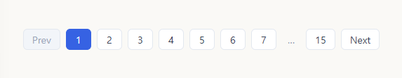
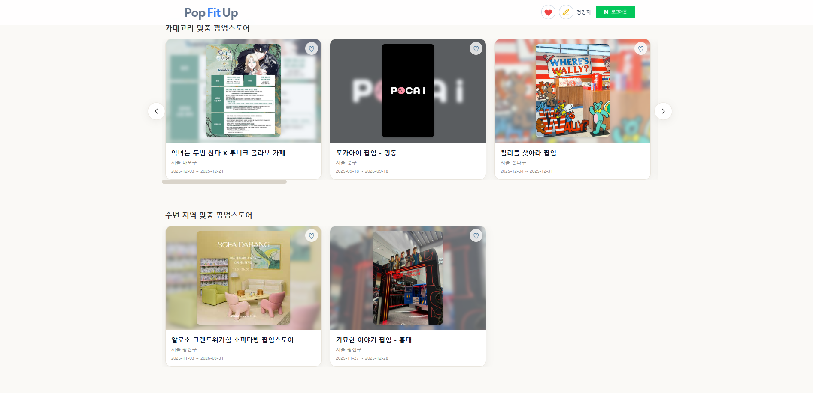
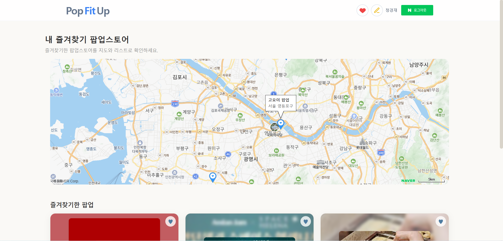
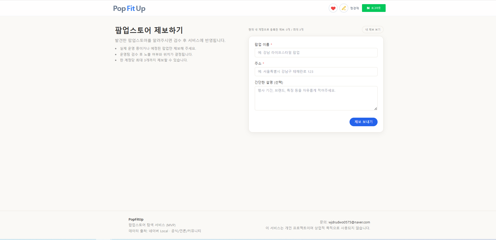
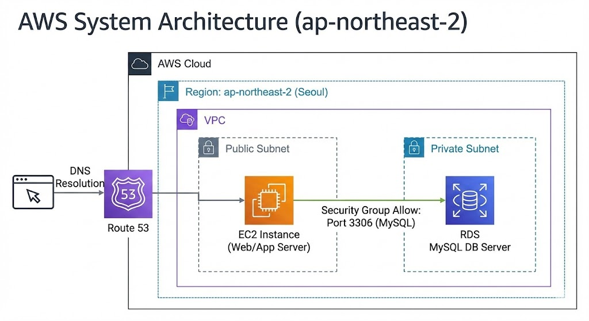
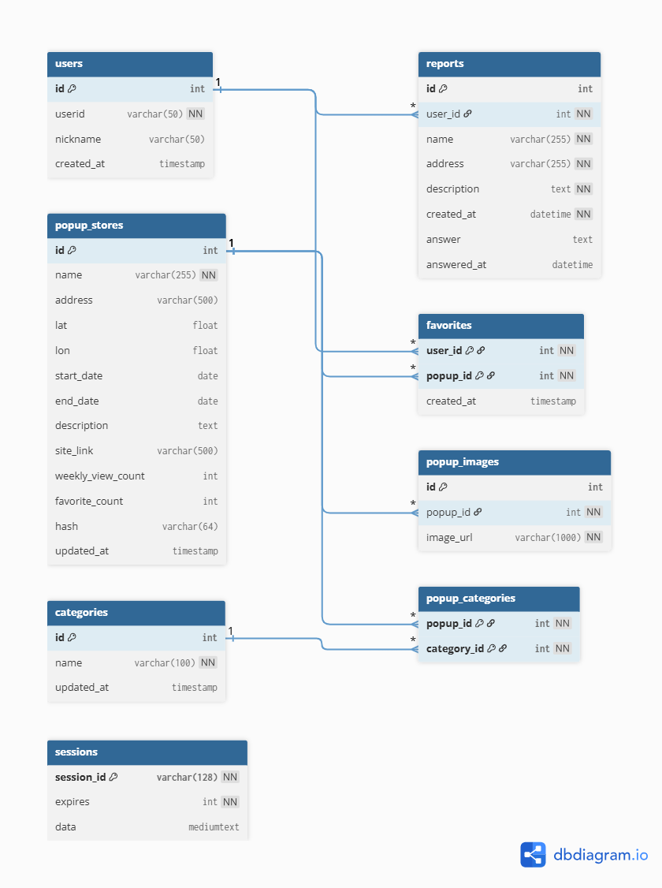
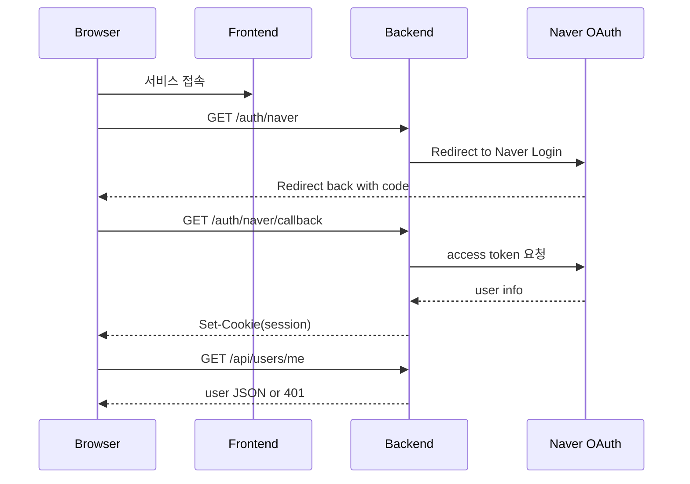

# 🛍️ PopFitUp

네이버 지도 기반 팝업스토어 탐색 서비스  
**Frontend & Backend 통합 프로젝트**

> 네이버 지도/로컬 검색 결과를 기반으로 수집된 팝업스토어 데이터를 활용하여  
> 사용자가 팝업스토어를 검색, 탐색, 즐겨찾기, 제보할 수 있도록 구현한 웹 서비스입니다.

---

## 👥 팀원

| 학번 | 이름 | 역할 |
| :---: | :---: | :--- |
| 21101217 | 이혁 | Backend |
| 21101224 | 정경재 | Frontend |

---

## 🚀 서비스 배포 현황

| 서비스명 | URL | 상태 |
| :--- | :--- | :--- |
| PopFitUp Web | [https://popfitup.store](https://popfitup.store) | Offline |

---

## 📌 Table of Contents

- 프로젝트 개요
- Repository Structure
- Tech Stack
- 서비스 주요 화면
- 전체 아키텍처
- Frontend 주요 기능
- Backend 주요 기능
- 인증 및 보안
- 관리자 기능
- API 요약
- 환경변수 설정
- 실행 방법
- 데모 시연 영상

---

## 1️⃣ 프로젝트 개요

**PopFitUp**은 지역, 날짜, 카테고리 기준으로 현재 운영 중이거나 예정된 팝업스토어를 탐색할 수 있는 서비스입니다.

백엔드는 수집·정제된 팝업스토어 데이터를 기반으로 검색, 상세 조회, 추천, 즐겨찾기, 제보 API를 제공합니다.

프론트엔드는 홈, 검색, 상세, 즐겨찾기, 제보, 관리자 화면을 구성하고, 백엔드 API와 네이버 지도 SDK를 연동하여 팝업스토어 탐색 흐름을 제공합니다.

이 저장소는 프론트엔드와 백엔드가 하나의 저장소에서 함께 관리되는 팀 프로젝트 저장소입니다.

---

## 2️⃣ Repository Structure

```text
popup-store
├─ docs
│  ├─ db
│  ├─ diagrams
│  └─ screens
│
├─ popup-backend
│  ├─ config
│  ├─ routes
│  ├─ scripts
│  └─ server.js
│
└─ popup-frontend
   ├─ public
   ├─ src
   ├─ package.json
   └─ README.md
```

---

## 3️⃣ Tech Stack

### Frontend

| 구분 | 기술 |
| --- | --- |
| Language | TypeScript |
| Framework | React |
| Build Tool | Vite |
| Routing | React Router |
| Styling | Tailwind CSS |
| Map | Naver Maps JavaScript SDK |
| API | Fetch 기반 공통 API Client |
| Auth | Session Cookie |

### Backend

| 구분 | 기술 |
| --- | --- |
| Runtime | Node.js |
| Framework | Express |
| Database | MySQL |
| Auth | Naver OAuth 2.0 |
| Session | express-session, MySQL session store |
| Infra | AWS, Nginx, HTTPS |

---

## 4️⃣ 서비스 주요 화면

### 🏠 홈 / 팝업 탐색

- 최신 팝업, 인기 팝업, 월별 팝업 탐색
- 지역, 날짜, 카테고리 기반 검색
- 검색 조건 URL query string 유지
- 홈 화면과 검색 결과 화면 분리


---

### 🔎 검색 결과 / 페이지네이션

- 지역, 날짜, 카테고리, 키워드 조건 기반 검색
- 검색 결과 페이지네이션
- 현재 페이지 기준 일부 페이지만 노출


<p align="center">
  
</p>

---

### 📍 팝업 상세 / 지도

- 팝업스토어 상세 정보 조회
- 운영 기간, 주소, 카테고리, 지역 태그 표시
- 네이버 지도 기반 위치 표시
- 좌표가 없는 데이터는 지도 영역 제외


---

### 🧭 연관 팝업 추천

- 같은 카테고리 기준 추천
- 주소 기반 주변 지역 추천
- 현재 팝업을 제외한 추천 목록 구성



---

### ❤️ 즐겨찾기

- 로그인 사용자 전용 즐겨찾기
- 즐겨찾기한 팝업스토어 목록 조회
- 지도 마커와 카드 리스트 동기화
- 마커 클릭 시 말풍선 표시
- 말풍선 클릭 시 관련 카드로 자동 스크롤



---

### 📝 팝업스토어 제보

- 로그인 사용자 제보 등록
- 내 제보 목록 조회
- 제보 삭제
- 운영자 답변 확인
- 사용자별 제보 개수 제한



---

### 🛠️ 관리자 제보 관리

- 관리자 키 기반 접근
- 전체 제보 목록 조회
- 제보 답변 등록
- 답변 완료 상태 표시
- 제보 삭제


---

### 📱 반응형 화면

- 모바일 / 태블릿 / 데스크탑 대응
- 검색 필터 반응형 배치
- 카드 그리드 반응형 처리
- 지도 영역 반응형 처리
- 모바일 헤더 메뉴 분리

<p align="center">
  
</p>

---

## 5️⃣ 전체 아키텍처



---

## 6️⃣ Frontend 주요 기능

PopFitUp 프론트엔드는 팝업스토어 탐색, 검색, 상세 조회, 즐겨찾기, 제보, 운영자 관리 화면을 제공합니다.

---

### 🏠 메인 화면 UI & 검색

- 지역 / 날짜 / 카테고리 기반 검색 UI
- URL query string 기반 검색 상태 유지
- 검색 결과 페이지네이션 지원
- 검색 화면과 일반 메인 화면을 `mode`로 구분

```ts
const params = new URLSearchParams(location.search)

const filters = {
  location: params.get('region') ?? '전체',
  date: params.get('date') ?? '',
  category: params.get('category') ?? '전체',
}

const page = Number(params.get('page') ?? '1')

params.set('mode', 'search')
params.set('page', '1')

navigate(`/?${params.toString()}`)
```

---

### 🧭 홈 화면 탐색 섹션

홈 화면은 여러 탐색 섹션으로 구성됩니다.

- 새로 들어온 팝업
- 인기 있는 팝업
- 월별 팝업
- 월 선택 UI
- 캐러셀 / 그리드 레이아웃

```ts
const homeData = await fetchHomePopups()

setLatestPopups(homeData.latest)
setPopularPopups(homeData.popular)
setMonthlyPopups(homeData.monthly)
```

홈 화면의 최신 / 인기 / 월별 팝업은 백엔드 SQL 조회 결과를 API로 받아 렌더링합니다.

---

### 📍 상세 페이지

팝업스토어 상세 페이지는 기본 정보, 지도, 추천 팝업 영역으로 구성됩니다.

- 팝업 상세 정보 제공
- 카테고리 / 지역 태그 표시
- 네이버 지도 기반 위치 표시
- 비슷한 팝업 추천
- 가까운 지역 팝업 추천

```ts
const popup = await fetchPopupDetail(id)
const similar = await fetchSimilarPopups(id)
const nearby = await fetchNearbyPopups(id)
```

비슷한 팝업은 같은 카테고리 기준으로 조회하고, 가까운 팝업은 주소 기반 지역 기준으로 조회합니다.

---

### ❤️ 즐겨찾기

즐겨찾기는 로그인 사용자 전용 기능입니다.

- 로그인 사용자 기준 즐겨찾기 기능 제공
- 팝업 카드 / 상세 페이지에서 즐겨찾기 상태 표시
- 즐겨찾기 목록 조회
- 즐겨찾기 페이지에서 지도와 리스트 함께 제공
- 지도 마커 클릭 시 말풍선 표시
- 말풍선 클릭 시 해당 카드로 자동 스크롤
- 비로그인 사용자는 로그인 안내 UI 노출

```ts
const toggleFavorite = async (popupId: number) => {
  if (!user) {
    openLoginRequired()
    return
  }

  await toggleFavoriteApi(popupId)
  await fetchFavorites()
}
```

---

### 📝 제보 / 운영자 UI

사용자는 서비스에 없는 팝업스토어를 제보할 수 있고, 운영자는 관리자 페이지에서 제보를 확인하고 답변하거나 삭제할 수 있습니다.

사용자 제보 기능은 다음과 같습니다.

- 팝업스토어 제보 등록
- 내 제보 목록 확인
- 제보 삭제
- 운영자 답변 확인

운영자 관리 기능은 다음과 같습니다.

- 전체 제보 목록 조회
- 제보별 답변 등록
- 답변 완료 상태 표시
- 제보 삭제

```ts
export async function createReport(payload: CreateReportPayload) {
  return api<ReportItem>('/api/reports', {
    method: 'POST',
    body: JSON.stringify(payload),
  })
}

export async function answerReport(reportId: number, answer: string) {
  return api<ReportItem>(`/api/reports/${reportId}/answer`, {
    method: 'POST',
    body: JSON.stringify({ answer }),
  })
}
```

---

### 🗺️ 네이버 지도 SDK 로딩 처리

네이버 지도 SDK는 외부 스크립트로 로드됩니다.

컴포넌트 렌더링 시점에 `window.naver.maps`가 준비되지 않을 수 있어, SDK 준비 여부를 확인한 뒤 지도를 초기화합니다.

```ts
if (!window.naver || !window.naver.maps) {
  retryTimerRef.current = window.setTimeout(initMap, 100)
  return
}

const position = new naver.maps.LatLng(lat, lon)

if (!mapInstanceRef.current) {
  const map = new naver.maps.Map(mapRef.current!, {
    center: position,
    zoom: 16,
  })

  mapInstanceRef.current = map

  markerRef.current = new naver.maps.Marker({
    position,
    map,
  })
} else {
  const map = mapInstanceRef.current

  map.setCenter(position)
  markerRef.current?.setPosition(position)
}
```

지도 인스턴스는 한 번 생성한 뒤 재사용하고, 좌표 변경 시 중심 좌표와 마커 위치를 갱신합니다.

---

### 🧩 크롤링 데이터 예외 처리

PopFitUp은 크롤링 기반 데이터를 사용하므로 일부 필드가 누락될 수 있습니다.

프론트엔드에서는 다음과 같은 데이터 상태를 처리합니다.

| 데이터 이슈 | UI 처리 |
| --- | --- |
| 좌표 없음 | 지도에는 표시하지 않고 카드 정보만 표시 |
| 이미지 없음 | placeholder 이미지 표시 |
| 카테고리 없음 | 기타 태그 표시 |
| 설명 없음 | 기본 안내 문구 표시 |
| 긴 설명 | 상세 페이지에서 줄바꿈 처리 |
| 추천 데이터 없음 | 추천 섹션 숨김 |
| 검색 결과 없음 | 빈 상태 UI 표시 |

---

### 📱 반응형 UI

- 메인 Hero 필터바 반응형 레이아웃
- 카드 리스트 / 검색 결과 / 즐겨찾기 목록 반응형 Grid
- 홈 섹션 캐러셀 가로 스크롤
- 모바일 / 데스크탑 지도 높이 분기
- 데스크탑 / 모바일 헤더 UI 분리

---

## 7️⃣ Backend 주요 기능

### 🌐 팝업스토어 데이터 제공 API

시스템의 안정성과 확장성을 위해 데이터 수집 레이어와 서비스 API 레이어를 분리했습니다.

복잡한 데이터 크롤링 및 가공은 별도 데이터 수집 프로젝트에서 수행하고, 서비스 서버는 구축된 DB를 기반으로 데이터 조회 API를 제공합니다.



---

### 🔍 상세 검색 및 필터링 시스템

사용자가 원하는 팝업스토어를 찾을 수 있도록 지역, 날짜, 카테고리, 키워드 조건을 조합할 수 있는 동적 쿼리를 구현했습니다.

각 조건은 `AND` 연산으로 결합됩니다.

- 지역: 주소 데이터 기준 포함 검색과 지역 라벨 검색 지원
- 날짜: 선택 날짜가 운영 기간에 포함되는지 검사
- 카테고리: 관계 테이블을 조인하여 M:N 구조의 카테고리 필터링 처리
- 통합 검색: 팝업스토어 이름, 설명, 주소 대상 키워드 매칭

```javascript
let where = []
let params = []

if (region) {
  where.push(
    'popup_stores.id IN (SELECT id FROM popup_stores WHERE address LIKE ? OR EXISTS (SELECT 1 FROM (SELECT id, CONCAT(SUBSTRING_INDEX(address, " ", 2)) AS region_label FROM popup_stores) AS rl WHERE rl.region_label LIKE ? AND rl.id = popup_stores.id))'
  )
  params.push(`%${region}%`, `%${region}%`)
}

if (date) {
  where.push('popup_stores.start_date <= ? AND popup_stores.end_date >= ?')
  params.push(date, date)
}

if (category) {
  const dbCategory = toEnglishCategory(category)
  where.push(
    'popup_stores.id IN (SELECT pc.popup_id FROM popup_categories pc JOIN categories c ON pc.category_id = c.id WHERE c.name = ?)'
  )
  params.push(dbCategory)
}

const whereClause = where.length ? 'WHERE ' + where.join(' AND ') : ''
```

---

### 🗓️ 최신 / 인기 / 월별 팝업 기준

#### 새로 들어온 팝업

최근에 정보가 수정되거나 등록된 `updated_at` 순서대로 정렬합니다.

```javascript
db.promise().query(
  'SELECT * FROM popup_stores ORDER BY updated_at DESC LIMIT 10'
)
```

#### 인기 팝업

즐겨찾기 수를 1순위로, 주간 조회수를 2순위로 하여 정렬합니다.

```javascript
db.promise().query(`
  SELECT * FROM popup_stores
  ORDER BY favorite_count DESC, weekly_view_count DESC
  LIMIT 10
`)
```

#### 월별 팝업

특정 월에 운영 기간이 겹치는 모든 팝업스토어를 조회합니다.

조건은 `(시작일 <= 해당 월 말일) AND (종료일 >= 해당 월 1일)`입니다.

```javascript
db.promise().query(
  `SELECT * FROM popup_stores
   WHERE start_date <= LAST_DAY(?) AND end_date >= ?
   ORDER BY start_date DESC`,
  [firstDay, firstDay]
)
```

---

### 🤝 연관 팝업 추천 시스템

상세 페이지에서는 위치 기반과 카테고리 기반 추천 데이터를 제공합니다.

#### 주변 팝업 추천

현재 팝업스토어의 주소에서 지역 단위 라벨을 추출하여 같은 지역의 팝업스토어를 조회합니다.

```javascript
const [nearbyRows] = await db.promise().query(
  `SELECT * FROM popup_stores
   WHERE id != ? AND (address LIKE ? OR CONCAT(SUBSTRING_INDEX(address, ' ', 2)) = ?)
   ORDER BY updated_at DESC LIMIT 12`,
  [popupId, `%${regionLabel}%`, regionLabel]
)
```

#### 비슷한 취향 추천

현재 팝업스토어의 카테고리를 기준으로 동일한 카테고리에 속한 다른 팝업스토어를 조회합니다.

`GROUP BY`를 사용하여 하나의 팝업이 여러 번 중복 추천되지 않도록 처리합니다.

```javascript
const popupId = req.params.id

const [catRows] = await db.promise().query(
  'SELECT c.name FROM categories c JOIN popup_categories pc ON c.id = pc.category_id WHERE pc.popup_id = ?',
  [popupId]
)

if (catRows.length === 0) {
  return res.json({ items: [] })
}

const categories = catRows.map(row => row.name)
const placeholders = categories.map(() => '?').join(',')

const query = `
  SELECT ps.* FROM popup_stores ps
  JOIN popup_categories pc ON ps.id = pc.popup_id
  JOIN categories c ON pc.category_id = c.id
  WHERE c.name IN (${placeholders}) AND ps.id != ?
  GROUP BY ps.id
  ORDER BY ps.updated_at DESC
  LIMIT 12
`
```

---

### ❤️ 즐겨찾기 기능

로그인한 사용자가 관심 있는 팝업스토어를 저장하고 관리할 수 있는 기능입니다.

#### 등록 및 해제

등록 시에는 `INSERT IGNORE` 구문을 사용하여 중복 저장을 방지합니다.

```javascript
await db.promise().query(
  'INSERT IGNORE INTO favorites (user_id, popup_id) VALUES (?, ?)',
  [userId, popupId]
)
```

해제 시에는 `DELETE` 구문을 사용하여 즐겨찾기 상태를 제거합니다.

```javascript
await db.promise().query(
  'DELETE FROM favorites WHERE user_id = ? AND popup_id = ?',
  [userId, popupId]
)
```

#### 카운트 자동 관리

MySQL 트리거가 `favorites` 테이블의 `INSERT/DELETE` 이벤트를 감지하여 `popup_stores.favorite_count`를 자동 동기화합니다.

---

## 8️⃣ 인증 및 보안

### 🔐 네이버 소셜 로그인

네이버 OAuth 2.0을 이용해 사용자가 네이버 계정으로 로그인할 수 있도록 구현했습니다.

인증 후 서버에서 사용자 정보를 받아 세션에 저장합니다.

---

### 🍪 세션 / 쿠키 기반 로그인

로그인 성공 시 서버는 세션 정보를 MySQL에 저장하고, 세션 ID를 쿠키로 클라이언트에 전달합니다.

세션 쿠키에는 HttpOnly, Secure, SameSite 옵션을 설정했습니다.

```javascript
session({
  store: sessionStore,
  secret: process.env.SESSION_SECRET,
  resave: false,
  saveUninitialized: false,
  proxy: true,
  cookie: {
    httpOnly: true,
    secure: true,
    sameSite: 'lax',
    maxAge: 60 * 60 * 1000,
  },
})
```

---

### 🌐 Nginx 리버스 프록시 & HTTPS

Nginx를 리버스 프록시로 두고 SSL 인증서를 적용하여 HTTPS 요청을 처리합니다.

Nginx는 HTTPS 요청을 받아 백엔드 서버로 전달합니다.

---

### 🔐 인증 플로우


```mermaid
sequenceDiagram
  participant B as Browser
  participant F as Frontend
  participant N as Backend
  participant O as Naver OAuth

  B->>F: 서비스 접속
  B->>N: GET /auth/naver
  N->>O: Redirect to Naver Login
  O-->>B: Redirect back with code
  B->>N: GET /auth/naver/callback
  N->>O: access token 요청
  O-->>N: user info
  N-->>B: Set-Cookie(session)
  B->>N: GET /api/users/me
  N-->>B: user JSON or 401
```

---

## 9️⃣ 관리자 기능

관리자는 제보된 팝업스토어 정보를 확인하고 답변하거나 삭제할 수 있습니다.

- 관리자 키 기반 접근 제어
- 제보 목록 조회
- 답변 등록
- 답변 완료 상태 표시
- 답변 등록 1회 제한
- 제보 삭제

---

## 🔟 API 요약

| Method | Endpoint | Description |
| --- | --- | --- |
| GET | `/api/popups/home` | 홈 데이터 조회 |
| GET | `/api/popups` | 팝업 검색 |
| GET | `/api/popups/:id` | 팝업 상세 |
| GET | `/api/popups/:id/similar` | 비슷한 팝업 추천 |
| GET | `/api/popups/:id/nearby` | 주변 팝업 추천 |
| GET | `/api/users/me` | 로그인 사용자 정보 조회 |
| GET | `/api/users/me/favorites` | 내 즐겨찾기 목록 조회 |
| POST | `/api/favorites` | 즐겨찾기 추가 |
| DELETE | `/api/favorites/:id` | 즐겨찾기 삭제 |
| POST | `/api/reports` | 팝업 제보 |
| GET | `/api/reports/mine` | 내 제보 목록 |
| DELETE | `/api/reports/:id` | 내 제보 삭제 |
| GET | `/api/reports?key=` | 관리자 제보 목록 |
| POST | `/api/reports/:id/answer?key=` | 관리자 제보 답변 |
| DELETE | `/api/reports/:id?key=` | 관리자 제보 삭제 |

---

## 1️⃣1️⃣ 환경변수 설정

### Frontend

`popup-frontend/.env`

```env
VITE_API_URL=http://localhost:3000
```

운영 환경에서는 `VITE_API_URL`을 배포된 API 서버 주소로 변경합니다.

---

### Backend

`popup-backend/.env`

```env
DB_HOST=localhost
DB_USER=root
DB_PASSWORD=****
DB_NAME=popup_db

NAVER_CLIENT_ID=****
NAVER_CLIENT_SECRET=****
NAVER_REDIRECT_URI=****
NAVER_STATE=****

NODE_ENV=development
SESSION_SECRET=****
REPORT_ADMIN_KEY=****
PORT=3000
```

---

## 1️⃣2️⃣ 실행 방법

### Frontend

```bash
cd popup-frontend
npm install
npm run dev
```

---

### Backend

```bash
cd popup-backend
npm install
npm run dev
```

---

## 1️⃣3️⃣ 데모 시연 영상

아래 이미지를 클릭하면 유튜브 영상으로 이동합니다.

[](https://youtu.be/cRrZcI5YlVA)

---

## 📎 참고

이 저장소는 프론트엔드와 백엔드가 함께 관리된 팀 프로젝트 저장소입니다.

프론트엔드 구현 상세 내용은 `popup-frontend/README.md`에서 확인할 수 있습니다.
